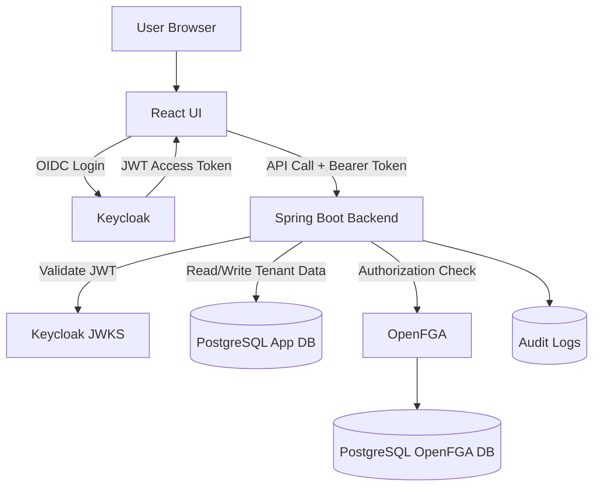
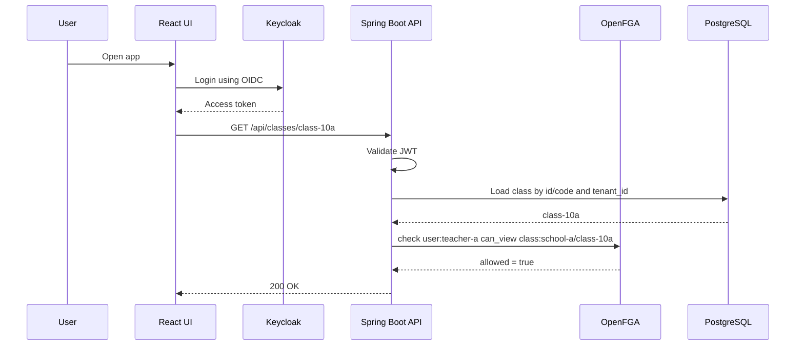

# AGENTS.md

## Project

Build a production-style proof of concept for **fine-grained access control** in a **multi-tenant SaaS application**.

The application is a multi-tenant **school SaaS platform**.

The PoC must demonstrate:

* Authentication using Keycloak
* Fine-grained authorization using OpenFGA
* Tenant-aware backend APIs using Spring Boot
* Tenant-scoped data access using PostgreSQL
* React UI using authenticated backend APIs
* Authorization checks enforced only by the backend
* Cross-tenant access denial
* Audit logging for authorization decisions

---

## Tech Stack

Use the following stack:

* Frontend: React
* Backend: Spring Boot
* Database: PostgreSQL
* Authentication: Keycloak
* Authorization: OpenFGA
* Local runtime: Docker Compose
* Optional future deployment target: Kubernetes

---

## Important Architectural Decisions

Follow these decisions strictly:

1. Use **one Keycloak realm** for the SaaS platform.
2. Do **not** create one Keycloak realm per tenant for this PoC.
3. Model tenants using Keycloak organizations, groups, or custom user attributes.
4. Use Keycloak for authentication and coarse identity information only.
5. Use OpenFGA for fine-grained authorization.
6. Use one OpenFGA store for the SaaS platform.
7. Model each tenant as an OpenFGA object.
8. Every tenant-owned PostgreSQL table must have `tenant_id`.
9. Backend must derive tenant from JWT/user context, not from request body.
10. React must never be trusted for authorization.
11. React must not call OpenFGA directly.
12. Spring Boot must validate JWT, resolve tenant context, check OpenFGA, and then execute business logic.
13. All protected APIs must enforce authorization in the backend.
14. All tenant-owned DB reads and writes must be scoped by tenant.
15. Authorization failures must return HTTP 403.
16. Important authorization decisions must be written to the audit log.

---

## Core Security Principle

Authentication answers:

```text
Who is the user?
```

Authorization answers:

```text
Can this user perform this action on this resource?
```

Spring Boot must enforce this flow:

```text
Validate JWT -> Resolve tenant -> Load resource by tenant -> Check OpenFGA -> Execute business logic
```

---

## Target Use Case

Build the PoC around a multi-tenant school SaaS platform.

### Tenants

```text
school-a
school-b
```

### Users

```text
admin-a
teacher-a
student-a
parent-a
teacher-b
```

### Resources

```text
tenant
class
student_profile
assignment
report
```

### Authorization Scenarios

Implement and demonstrate these scenarios:

1. Admin A can manage School A.
2. Teacher A can view assigned classes in School A.
3. Teacher A can create assignments for assigned classes.
4. Student A can view own assignments.
5. Parent A can view own child's report.
6. Teacher B from School B must not access School A resources.
7. Student A must not delete assignments.
8. Parent A must not view reports of other students.

---

## Repository Structure

Create this repository structure:

```text
authorization-poc/
  AGENTS.md
  docker-compose.yml
  README.md

  backend/
    build.gradle or pom.xml
    Dockerfile
    src/main/java/...
    src/main/resources/application.yml
    src/test/java/...

  frontend/
    package.json
    Dockerfile
    src/...

  infra/
    keycloak/
      realm-export.json
      setup-notes.md

    openfga/
      model.fga
      tuples.json
      setup.sh

    postgres/
      init.sql
      seed.sql
```

Prefer Gradle for the Spring Boot backend unless there is a strong reason to use Maven.

---

## Backend Requirements

Create a Spring Boot backend with clear package boundaries.

Suggested packages:

```text
com.example.authorizationpoc
  auth
    JwtTenantResolver
    CurrentUser
    CurrentUserProvider
    TenantContext
    SecurityConfig

  authz
    AuthzClient
    OpenFgaAuthzClient
    Permission
    AuthorizationService
    AuthorizationExceptionHandler
    optional CheckPermission annotation

  tenant
  userprofile
  schoolclass
  student
  assignment
  report
  audit
  common
```

---

## Backend API Requirements

Implement these REST APIs.

### 1. Current User API

```http
GET /api/me
```

Returns:

* current user id
* username
* email
* tenant id
* tenant code
* role
* simple feature flags
* allowed navigation/menu hints

Example response:

```json
{
  "userId": "teacher-a",
  "tenantCode": "school-a",
  "displayName": "Teacher A",
  "roles": ["teacher"],
  "features": {
    "canManageSchool": false,
    "canCreateAssignment": true,
    "canViewReports": true
  }
}
```

---

### 2. Create Class

```http
POST /api/classes
```

Admin can create a class inside own tenant.

Do not accept `tenant_id` from request body.

Backend must derive tenant from JWT/current user.

---

### 3. List Classes

```http
GET /api/classes
```

Returns classes visible to the current user.

The backend must not return classes from another tenant.

---

### 4. Get Class

```http
GET /api/classes/{classId}
```

Requires OpenFGA check:

```text
user:{username} can_view class:{tenantCode}/{classCodeOrId}
```

---

### 5. Assign Teacher to Class

```http
POST /api/classes/{classId}/teachers/{userId}
```

Admin can assign teacher to class.

This operation should create an OpenFGA tuple:

```text
class:{tenantCode}/{classCodeOrId}#teacher@user:{teacherUsername}
```

Also persist necessary application data if required.

---

### 6. Create Assignment

```http
POST /api/classes/{classId}/assignments
```

Requires OpenFGA check:

```text
user:{username} can_create_assignment class:{tenantCode}/{classCodeOrId}
```

The assignment should be created in the current tenant only.

---

### 7. Get Student Profile

```http
GET /api/students/{studentId}
```

Requires OpenFGA check:

```text
user:{username} can_view student_profile:{tenantCode}/{studentCodeOrId}
```

---

### 8. Get Report

```http
GET /api/reports/{reportId}
```

Requires OpenFGA check:

```text
user:{username} can_view report:{tenantCode}/{reportCodeOrId}
```

---

### 9. Debug Authorization Check

```http
GET /api/debug/authz/check
```

For PoC only.

This API can accept:

```text
relation
object
```

The current user must come from JWT.

Example:

```http
GET /api/debug/authz/check?relation=can_view&object=class:school-a/class-10a
```

Response:

```json
{
  "user": "user:teacher-a",
  "relation": "can_view",
  "object": "class:school-a/class-10a",
  "allowed": true
}
```

This endpoint must be clearly marked as non-production.

---

## Protected API Flow

Every protected API must follow this flow:

```text
1. Validate JWT from Keycloak.
2. Resolve current user and tenant.
3. Load resource from PostgreSQL using id + tenant_id.
4. Call OpenFGA check.
5. If allowed, execute business logic.
6. If denied, return HTTP 403.
7. Write an audit log entry.
```

Do not skip step 3.

Do not rely only on OpenFGA for tenant isolation.

Do not rely only on database filtering for authorization.

Use both.

---

## PostgreSQL Schema

Create the following tables.

### tenants

```sql
create table tenants (
    id uuid primary key,
    code varchar(100) unique not null,
    name varchar(255) not null
);
```

### user_profiles

```sql
create table user_profiles (
    id uuid primary key,
    keycloak_user_id varchar(255) unique not null,
    tenant_id uuid not null references tenants(id),
    username varchar(100) not null,
    email varchar(255),
    display_name varchar(255),
    role varchar(100) not null
);
```

### school_classes

```sql
create table school_classes (
    id uuid primary key,
    tenant_id uuid not null references tenants(id),
    code varchar(100) not null,
    name varchar(255) not null,
    section varchar(100),
    created_by uuid references user_profiles(id),
    unique (tenant_id, code)
);
```

### students

```sql
create table students (
    id uuid primary key,
    tenant_id uuid not null references tenants(id),
    code varchar(100) not null,
    class_id uuid references school_classes(id),
    name varchar(255) not null,
    owner_user_id uuid references user_profiles(id),
    unique (tenant_id, code)
);
```

### assignments

```sql
create table assignments (
    id uuid primary key,
    tenant_id uuid not null references tenants(id),
    code varchar(100) not null,
    class_id uuid not null references school_classes(id),
    title varchar(255) not null,
    description text,
    created_by uuid references user_profiles(id),
    unique (tenant_id, code)
);
```

### reports

```sql
create table reports (
    id uuid primary key,
    tenant_id uuid not null references tenants(id),
    code varchar(100) not null,
    student_id uuid not null references students(id),
    report_type varchar(100) not null,
    content text,
    unique (tenant_id, code)
);
```

### audit_logs

```sql
create table audit_logs (
    id uuid primary key,
    tenant_id uuid,
    user_id uuid,
    action varchar(255) not null,
    resource_type varchar(100),
    resource_id varchar(255),
    allowed boolean,
    reason text,
    created_at timestamp not null
);
```

---

## Seed Data

Seed the following data.

### Tenants

```text
school-a
school-b
```

### Users

```text
admin-a     -> school-a -> admin
teacher-a   -> school-a -> teacher
student-a   -> school-a -> student
parent-a    -> school-a -> parent
teacher-b   -> school-b -> teacher
```

### Classes

```text
school-a/class-10a
school-b/class-10b
```

### Student Profiles

```text
school-a/student-a
```

### Assignments

```text
school-a/assignment-1
```

### Reports

```text
school-a/report-1
```

Use stable UUIDs in seed data so tests and examples can be deterministic.

---

## OpenFGA Requirements

Create:

```text
infra/openfga/model.fga
infra/openfga/tuples.json
infra/openfga/setup.sh
```

Use one OpenFGA store for the SaaS platform.

Store name:

```text
school-saas-store
```

---

## OpenFGA Authorization Model

Create `infra/openfga/model.fga` with this model:

```fga
model
  schema 1.1

type user

type tenant
  relations
    define admin: [user]
    define member: [user]
    define teacher: [user]
    define student: [user]
    define can_manage: admin
    define can_view: admin or member

type class
  relations
    define tenant: [tenant]
    define owner: [user]
    define teacher: [user]
    define student: [user]
    define can_view: owner or teacher or student or admin from tenant
    define can_manage: owner or admin from tenant
    define can_create_assignment: teacher or admin from tenant

type assignment
  relations
    define class: [class]
    define creator: [user]
    define can_view: can_view from class
    define can_update: creator or can_manage from class
    define can_delete: can_manage from class

type student_profile
  relations
    define tenant: [tenant]
    define class: [class]
    define owner: [user]
    define parent: [user]
    define can_view: owner or parent or teacher from class or admin from tenant
    define can_update: teacher from class or admin from tenant

type report
  relations
    define student: [student_profile]
    define can_view: can_view from student
```

---

## OpenFGA Tuple Requirements

Create tuples for the following relationships:

```text
tenant:school-a#admin@user:admin-a
tenant:school-a#teacher@user:teacher-a
tenant:school-a#member@user:teacher-a
tenant:school-a#member@user:student-a
tenant:school-a#member@user:parent-a

tenant:school-b#teacher@user:teacher-b
tenant:school-b#member@user:teacher-b

class:school-a/class-10a#tenant@tenant:school-a
class:school-a/class-10a#teacher@user:teacher-a
class:school-a/class-10a#student@user:student-a

class:school-b/class-10b#tenant@tenant:school-b
class:school-b/class-10b#teacher@user:teacher-b

student_profile:school-a/student-a#tenant@tenant:school-a
student_profile:school-a/student-a#class@class:school-a/class-10a
student_profile:school-a/student-a#owner@user:student-a
student_profile:school-a/student-a#parent@user:parent-a

assignment:school-a/assignment-1#class@class:school-a/class-10a
assignment:school-a/assignment-1#creator@user:teacher-a

report:school-a/report-1#student@student_profile:school-a/student-a
```

---

## OpenFGA Object Naming Convention

Use this convention consistently:

```text
tenant:{tenantCode}
class:{tenantCode}/{classCode}
student_profile:{tenantCode}/{studentCode}
assignment:{tenantCode}/{assignmentCode}
report:{tenantCode}/{reportCode}
user:{username}
```

Examples:

```text
tenant:school-a
class:school-a/class-10a
student_profile:school-a/student-a
assignment:school-a/assignment-1
report:school-a/report-1
user:teacher-a
```

Do not mix UUIDs and codes in OpenFGA object IDs unless explicitly documented.

For the PoC, prefer stable readable codes in OpenFGA object IDs.

---

## OpenFGA Client Behavior

Create a backend `AuthzClient` abstraction.

Example:

```java
public interface AuthzClient {
    boolean isAllowed(String user, String relation, String object);

    void check(String user, String relation, String object);
}
```

`check` should throw an access denied exception if not allowed.

OpenFGA implementation:

```java
@Service
public class OpenFgaAuthzClient implements AuthzClient {
    // call OpenFGA check API
}
```

Use the abstraction everywhere in business services.

Do not call OpenFGA directly from controllers.

---

## Keycloak Requirements

Create one Keycloak realm:

```text
saas-platform
```

Create clients:

```text
react-ui
spring-api
```

Create users:

```text
admin-a
teacher-a
student-a
parent-a
teacher-b
```

Each user should have attributes:

```text
tenant_id
tenant_code
app_user_id
role
```

Example:

```text
admin-a:
  tenant_code = school-a
  role = admin

teacher-a:
  tenant_code = school-a
  role = teacher

student-a:
  tenant_code = school-a
  role = student

parent-a:
  tenant_code = school-a
  role = parent

teacher-b:
  tenant_code = school-b
  role = teacher
```

Configure JWT token mappers so Spring Boot receives:

```text
sub
preferred_username
email
tenant_id
tenant_code
app_user_id
role
```

For local development, document usernames and passwords in the README.

Use simple passwords only for PoC local development.

---

## Spring Security Requirements

Configure Spring Boot as OAuth2 Resource Server.

The backend must:

1. Validate JWT issuer from Keycloak.
2. Extract username from `preferred_username`.
3. Extract tenant from `tenant_code`.
4. Extract role from token claims.
5. Resolve matching `user_profiles` row.
6. Create `CurrentUser`.
7. Make `CurrentUser` available to services.

Do not allow unauthenticated access to protected APIs.

Allowed unauthenticated endpoints:

```text
/actuator/health
/swagger-ui/**
/v3/api-docs/**
```

Only expose Swagger if implemented.

---

## Tenant Context Requirements

Create a `CurrentUser` object with:

```java
public record CurrentUser(
    UUID appUserId,
    String keycloakUserId,
    String username,
    String email,
    UUID tenantId,
    String tenantCode,
    String role
) {}
```

All service methods that access tenant-owned data should accept or internally resolve `CurrentUser`.

Avoid passing raw `tenantId` from controllers unless it comes from `CurrentUser`.

---

## Database Access Rules

Every tenant-owned query must filter by tenant.

Good:

```sql
select *
from school_classes
where id = :classId
and tenant_id = :tenantId;
```

Bad:

```sql
select *
from school_classes
where id = :classId;
```

Repositories should expose tenant-scoped methods.

Example:

```java
Optional<SchoolClass> findByIdAndTenantId(UUID id, UUID tenantId);
Optional<SchoolClass> findByCodeAndTenantId(String code, UUID tenantId);
List<SchoolClass> findAllByTenantId(UUID tenantId);
```

Do not create generic unsafe methods for protected resources unless they are private/internal and carefully guarded.

---

## Audit Logging Requirements

Create audit logs for important authorization decisions.

Audit log should capture:

```text
tenant_id
user_id
action
resource_type
resource_id
allowed
reason
created_at
```

Examples:

```text
VIEW_CLASS
CREATE_ASSIGNMENT
VIEW_STUDENT_PROFILE
VIEW_REPORT
ASSIGN_TEACHER_TO_CLASS
```

For denied checks, include reason like:

```text
OpenFGA denied user:teacher-b can_view class:school-a/class-10a
```

---

## React Requirements

Create a simple React application.

Required screens/components:

1. Login
2. Logout
3. Current user profile
4. Tenant display
5. Class list
6. Class details
7. Assignment creation
8. Student profile view
9. Report view
10. Access denied message

React must use Keycloak login.

React must call backend APIs with Bearer token.

React must not call OpenFGA.

React may hide buttons based on backend-provided feature flags, but backend must still enforce authorization.

Example:

```text
React can hide "Create Assignment"
Backend must still check can_create_assignment
```

---

## Docker Compose Requirements

Create a `docker-compose.yml` with:

```text
postgres
keycloak
openfga
backend
frontend
```

PostgreSQL should contain separate databases if practical:

```text
keycloak_db
app_db
openfga_db
```

OpenFGA should use PostgreSQL as datastore.

Keycloak should use PostgreSQL as datastore.

Spring Boot should connect to app PostgreSQL database.

The full PoC should run locally using:

```bash
docker compose up
```

or:

```bash
docker compose up --build
```

Document any required setup commands.

---

## README Requirements

Write a detailed `README.md` with the following sections:

1. Project overview
2. Architecture overview
3. Why one Keycloak realm is used
4. Why OpenFGA is used for authorization
5. Authentication vs authorization explanation
6. Request flow
7. Local setup
8. How to start the PoC
9. How to login as each user
10. Test users and passwords
11. API examples using curl
12. OpenFGA model explanation
13. OpenFGA tuple explanation
14. Tenant isolation explanation
15. Cross-tenant denial demo
16. How to run tests
17. Known limitations
18. Production hardening checklist

---

## README Architecture Diagram

Include this system-level architecture diagram in the README:



---

## README Request Flow Diagram

Include this request flow:



---

## Production Hardening Checklist

Include this checklist in README:

```text
- HTTPS everywhere
- Keycloak HA setup
- OpenFGA HA setup
- Separate databases for Keycloak, application, and OpenFGA
- Database migrations using Flyway or Liquibase
- Audit logging and retention policy
- Rate limiting by tenant
- Centralized logging
- Monitoring with Prometheus and Grafana
- Distributed tracing
- Token expiry and refresh strategy
- Secret management using Vault, AWS Secrets Manager, or KMS
- Backup and restore for PostgreSQL
- Tenant onboarding automation
- Keycloak realm/client export versioning
- OpenFGA model version management
- OpenFGA tuple migration strategy
- Integration tests for authorization
- Cross-tenant access test suite
- Least privilege database users
- Network policies if deployed on Kubernetes
- CI pipeline with security checks
```

---

## Testing Requirements

Add tests for these scenarios:

1. `admin-a` can create class in `school-a`.
2. `teacher-a` can view `school-a/class-10a`.
3. `teacher-a` can create assignment for assigned class.
4. `teacher-b` cannot view `school-a/class-10a`.
5. `student-a` can view own assignment.
6. `student-a` cannot delete assignment.
7. `parent-a` can view own child report.
8. `parent-a` cannot view unrelated report.

Use Testcontainers if practical for PostgreSQL and OpenFGA.

If Testcontainers makes the PoC too heavy, provide:

1. Unit tests with mocked `AuthzClient`
2. Service-level authorization tests
3. At least one integration test profile

Tests must prove that backend authorization works even if React hides or shows buttons incorrectly.

---

## Implementation Style

Build incrementally.

Do not implement everything in one huge change.

Use this sequence:

### Step 1

Create repository structure.

Create:

```text
docker-compose.yml
backend skeleton
frontend skeleton
README outline
```

### Step 2

Add PostgreSQL schema and seed data.

Create:

```text
infra/postgres/init.sql
infra/postgres/seed.sql
```

### Step 3

Add Keycloak setup.

Create:

```text
infra/keycloak/realm-export.json
infra/keycloak/setup-notes.md
```

### Step 4

Add OpenFGA setup.

Create:

```text
infra/openfga/model.fga
infra/openfga/tuples.json
infra/openfga/setup.sh
```

### Step 5

Implement Spring Security JWT validation.

Implement:

```text
SecurityConfig
CurrentUser
CurrentUserProvider
JwtTenantResolver
```

### Step 6

Implement OpenFGA client abstraction.

Implement:

```text
AuthzClient
OpenFgaAuthzClient
AuthorizationService
```

### Step 7

Implement tenant-aware domain APIs.

Implement:

```text
/api/me
/api/classes
/api/students
/api/reports
/api/debug/authz/check
```

### Step 8

Implement React UI.

Implement:

```text
login
logout
profile
class list
class details
student profile
report view
assignment creation
access denied screen
```

### Step 9

Add tests.

Implement authorization tests and cross-tenant denial tests.

### Step 10

Complete README.

Include diagrams, run instructions, demo scenarios, and production checklist.

---

## Required Review Checklist

Before considering the task complete, review the implementation for:

1. Tenant isolation mistakes
2. APIs trusting `tenant_id` from request body
3. Missing OpenFGA checks
4. Missing database tenant filters
5. React doing authorization instead of backend
6. JWT claim mapping issues
7. OpenFGA object naming inconsistencies
8. Missing audit logs
9. Docker Compose startup issues
10. README gaps
11. Missing cross-tenant denial tests
12. OpenFGA tuples not matching DB seed data
13. Keycloak users not matching DB user profiles
14. Unclear local run instructions

Fix issues directly in code.

---

## Non-Goals for the Initial PoC

Do not implement these unless the core PoC is already working:

```text
Kubernetes deployment
Helm charts
Terraform
CI/CD pipeline
Multi-region deployment
Real payment/billing system
Complex tenant onboarding workflow
Advanced admin UI
Custom Keycloak theme
Production secret manager integration
```

Mention these as future improvements in README only.

---

## Expected Deliverables

The final repository must contain:

1. Working Docker Compose setup
2. Spring Boot backend
3. React frontend
4. PostgreSQL schema and seed data
5. Keycloak realm export or clear setup script
6. OpenFGA model and tuples
7. Backend authorization enforcement
8. Tenant-scoped database access
9. Audit logging
10. README with run instructions
11. Authorization test cases
12. Demo scenarios proving allowed and denied access

---

## Final Acceptance Criteria

The PoC is considered successful only if these are true:

1. A user can login through Keycloak.
2. Backend validates Keycloak JWT.
3. Backend resolves current user and tenant.
4. Backend loads tenant-owned resources using tenant filter.
5. Backend checks OpenFGA before protected operations.
6. Teacher A can access School A class.
7. Teacher B cannot access School A class.
8. Student A cannot perform teacher/admin-only actions.
9. Parent A can view own child report.
10. Parent A cannot view unrelated reports.
11. Authorization failures return HTTP 403.
12. Audit logs are written for authorization decisions.
13. README explains how to run and test everything locally.

---

## First Task to Execute

Start by creating:

```text
docker-compose.yml
backend skeleton
frontend skeleton
infra folder structure
README outline
```

After that, report:

1. Files created or modified
2. How to run the current state
3. What is working
4. What is pending

Do not move to the next major step until the current step is coherent and runnable.
