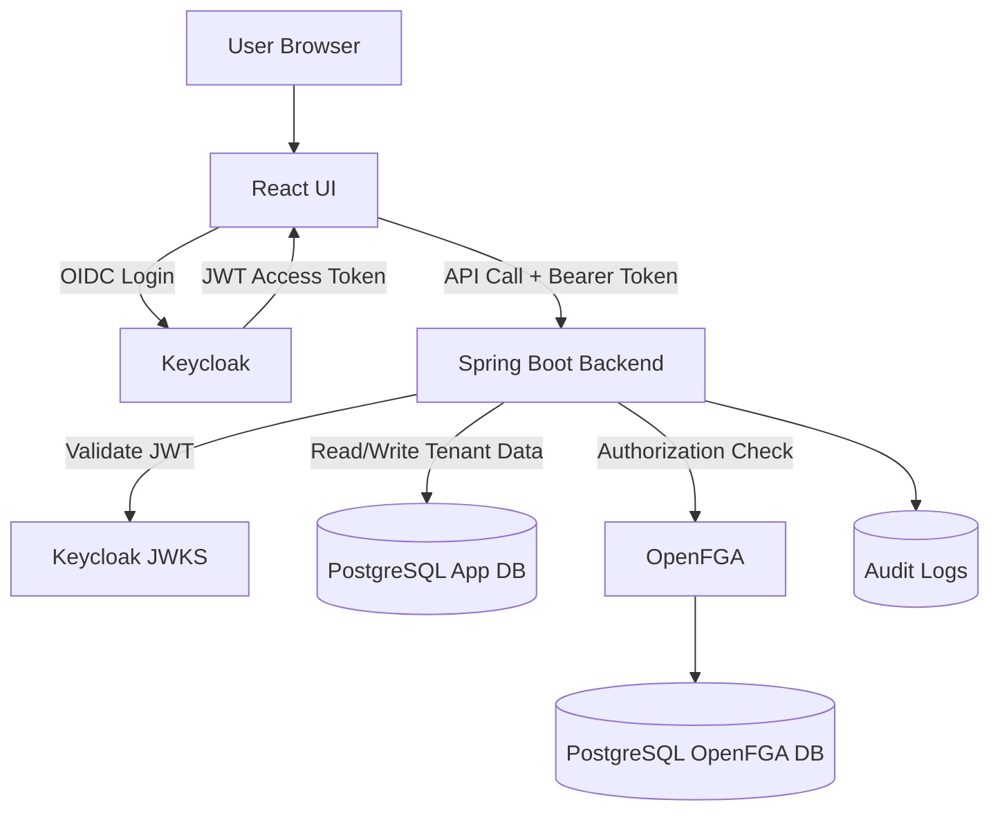
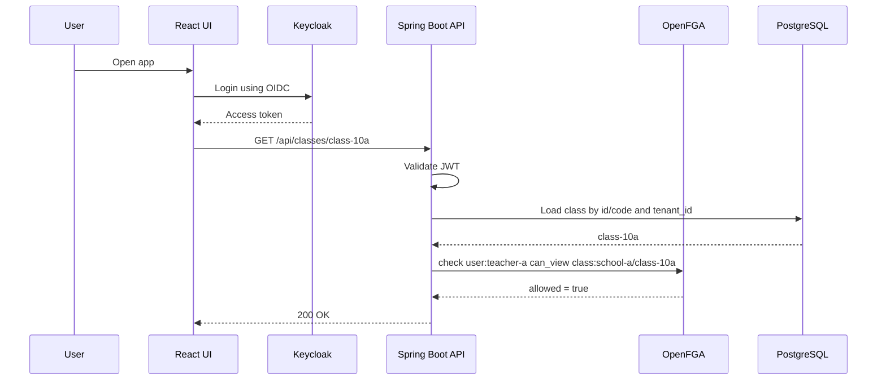

# Authorization PoC

## Project Overview

This repository is a production-style proof of concept for fine-grained authorization in a multi-tenant school SaaS platform.

The goal is to show a backend-first security model:

- Keycloak handles authentication and coarse identity data.
- OpenFGA handles fine-grained authorization.
- Spring Boot resolves tenant context, checks authorization, and enforces tenant-scoped data access.
- PostgreSQL stores tenant-owned business data and audit logs.
- React is only a client and never decides access on its own.

## Architecture Overview



## Why One Keycloak Realm Is Used

This PoC uses a single Keycloak realm, `saas-platform`, because the tenant boundary belongs in the application and authorization model, not in a separate realm per customer.

That keeps identity management simpler and makes the tenant relationship explicit in token claims such as `tenant_id`, `tenant_code`, `app_user_id`, and `role`.

## Why OpenFGA Is Used

OpenFGA is the fine-grained authorization layer.

It is a better fit than hard-coded role checks because the model can express relationships such as:

- teachers assigned to a class
- parents linked to a student profile
- tenant admins managing tenant-scoped resources

The backend still owns enforcement. OpenFGA only answers whether a user can perform an action on an object.

## Authentication vs Authorization

Authentication answers: who is the user?

Authorization answers: can this user perform this action on this resource?

The runtime flow is:

```text
Validate JWT -> Resolve tenant -> Load resource by tenant -> Check OpenFGA -> Execute business logic
```

## Request Flow



## Local Setup

Requirements:

- Docker Engine / Docker Desktop
- Git

The stack uses these services:

- `keycloak-db`
- `app-db`
- `openfga-db`
- `keycloak`
- `openfga`
- `backend`
- `frontend`

## How to Start the PoC

```bash
docker compose up --build
```

Service URLs:

- React UI: `http://localhost:3000`
- Backend: `http://localhost:8080`
- Keycloak: `http://localhost:8081`
- OpenFGA: `http://localhost:8082`

## How to Login

This PoC seeds the following Keycloak users:

- `admin-a`
- `teacher-a`
- `student-a`
- `parent-a`
- `teacher-b`

Local password for all users:

```text
password
```

Current frontend shell uses a mock session. Real OIDC login wiring is still pending.

## Test Users and Passwords

| Username | Tenant   | Role     | Password |
| --- | --- | --- | --- |
| `admin-a` | `school-a` | `admin` | `password` |
| `teacher-a` | `school-a` | `teacher` | `password` |
| `student-a` | `school-a` | `student` | `password` |
| `parent-a` | `school-a` | `parent` | `password` |
| `teacher-b` | `school-b` | `teacher` | `password` |

## API Examples

Current user:

```bash
curl -H "Authorization: Bearer <token>" http://localhost:8080/api/me
```

List classes:

```bash
curl -H "Authorization: Bearer <token>" http://localhost:8080/api/classes
```

Get a class:

```bash
curl -H "Authorization: Bearer <token>" http://localhost:8080/api/classes/33333333-3333-3333-3333-333333333331
```

Assign a teacher:

```bash
curl -X POST -H "Authorization: Bearer <token>" http://localhost:8080/api/classes/33333333-3333-3333-3333-333333333331/teachers/teacher-a
```

Debug authorization check:

```bash
curl -H "Authorization: Bearer <token>" "http://localhost:8080/api/debug/authz/check?relation=CAN_VIEW&object=class:school-a/class-10a"
```

## OpenFGA Model

The model is stored in `infra/openfga/model.fga`.

It uses:

- `tenant` as a first-class object
- `class`, `student_profile`, `assignment`, and `report` as tenant-scoped objects
- direct relations that capture tenant admin, teachers, ownership, and parent visibility

## OpenFGA Tuples

Seed tuples are stored in `infra/openfga/tuples.json`.

They model:

- tenant membership
- class ownership and teacher assignment
- student ownership
- parent access to a student profile
- assignment ownership
- report linkage to a student profile

For this PoC, the OpenFGA object relations are intentionally kept direct so the bootstrap path is deterministic and easy to run locally.

## OpenFGA Bootstrap

Use `infra/openfga/setup.sh` to create the `school-saas-store`, apply the authorization model, and load the seed tuples.

Example:

```bash
OPENFGA_API_URL=http://localhost:8082 sh infra/openfga/setup.sh
```

The script expects the OpenFGA API to be reachable and reads the model and tuple files from the repository.

## Tenant Isolation

Tenant isolation is enforced in two places:

1. PostgreSQL queries always include `tenant_id`.
2. OpenFGA checks control whether the user can act on the resource.

The backend never trusts tenant input from the request body.

## Cross-Tenant Denial Demo

The intended denial case is:

- `teacher-b` from `school-b` tries to access `school-a/class-10a`
- the backend loads only tenant-matching data
- OpenFGA denies the action
- the API returns HTTP 403

## How to Run Tests

```bash
cd backend
./gradlew test
```

On Windows PowerShell:

```powershell
cd backend
gradle test
```

Current test coverage is service-level and uses mocks plus in-memory repositories.

## Known Limitations

- React uses a mock session instead of real OIDC login.
- OpenFGA is wired through HTTP, but the bootstrap flow for store creation and tuple import still needs a proper setup script.
- Some backend operations are still scaffolded rather than fully integrated end to end.
- There is no production-grade migration framework yet.
- There is no real integration test profile yet.

## Production Hardening Checklist

- HTTPS everywhere
- Keycloak HA setup
- OpenFGA HA setup
- Separate databases for Keycloak, application, and OpenFGA
- Database migrations using Flyway or Liquibase
- Audit logging and retention policy
- Rate limiting by tenant
- Centralized logging
- Monitoring with Prometheus and Grafana
- Distributed tracing
- Token expiry and refresh strategy
- Secret management using Vault, AWS Secrets Manager, or KMS
- Backup and restore for PostgreSQL
- Tenant onboarding automation
- Keycloak realm/client export versioning
- OpenFGA model version management
- OpenFGA tuple migration strategy
- Integration tests for authorization
- Cross-tenant access test suite
- Least privilege database users
- Network policies if deployed on Kubernetes
- CI pipeline with security checks

## Future Work

Not implemented yet:

- Kubernetes deployment
- Helm charts
- Terraform
- CI/CD pipeline
- Multi-region deployment
- Real payment/billing system
- Complex tenant onboarding workflow
- Advanced admin UI
- Custom Keycloak theme
- Production secret manager integration
